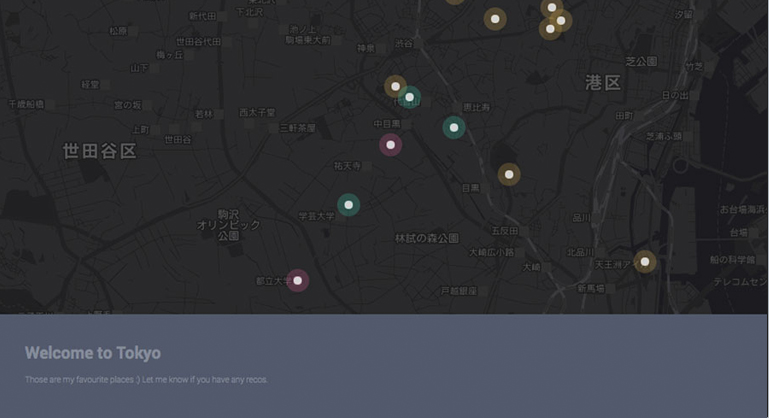

Which information is indispensable? It is the question asked throughout this little project exploring with [Google Maps API](https://developers.google.com/maps/documentation/javascript/). You can find this project [here](http://yukinokoh.github.io/jMap/).

## Structure
- `index.html`: This html file shows your map on browser, 
	loading necessary js files
- js
  - `map.js`: javascript to customize Google Maps
  - `circle.js`: javascript to plot in the map
  - `xxArray.js`: Data to plot in the map
- css
  - `style.css`: css to custom mainly text area
- img
  - `close.png`: only in case of use infobubble, which is in default cross outed
  - `tokyo\_favi.png`: favicon image 
  - `jmap.jpg`: sample image you see in README
- README.md
- LICENSE.txt

## Usage
### To modify title and introduction
Edit **h1**  and **p** elements in var dafault\_text in `circle.js` 

## To modify plotting data
1. Edit `xxArray.js` to edit data
```javascript

var your_category_name = {};
your_category_name['Name_of_place'] = {
        latlng: [lat, lng],
        url: 'url_that_provide_information_of_the_place'
};

```

2. Allow `index.html` to load your `xxArray.js` as following
```html

<script type="text/javascript" src="js/xxArray.js"></script>

``` 

3. Pass the information of data to drawArray() function in `map.js` 
```javascript

drawArray(your_category_name,'#color', 'your_class_name');

```
- your_category_name: it should match to the one you defined in step 1.
- #color: this color will be used to plot circle in the map.
- your_class_name: you can defined the class for css to edit information texts in `style.css`

## To edit map style
Edit map options in `map.js`
Documentation of [Style Reference](https://developers.google.com/maps/documentation/javascript/style-reference)

## To edit custom Marker
Edit **circle** in `circle.js`
Documentation of [Custom Marker](https://developers.google.com/maps/documentation/javascript/examples/marker-symbol-custom)

